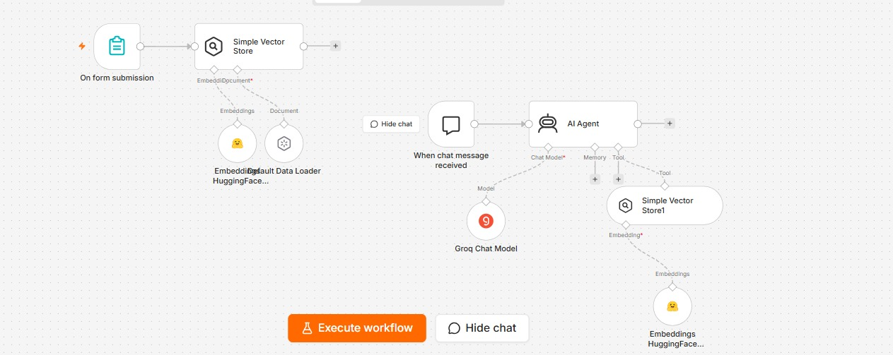
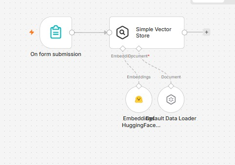

<div align="center">

# 🤖 HR Policy Assistant using RAG, n8n & Groq LLM

### AI-Powered HR Policy Question Answering with Retrieval-Augmented Generation (RAG)


</div>

---

# 🚀 Overview

HR policies are often stored in lengthy documents, making it difficult for employees to quickly find accurate information.

This project uses **Retrieval-Augmented Generation (RAG)** to build an intelligent HR Policy Assistant. Instead of relying only on an LLM's general knowledge, the assistant retrieves relevant information from HR policy documents using a **Vector Store** and **HuggingFace Embeddings**, then generates accurate responses with **Groq LLM**.

Built entirely using **n8n**, this workflow demonstrates how AI agents can interact with company knowledge bases to answer questions in natural language.

---

# ✨ Features

- 📄 HR Policy Knowledge Base
- 🤖 AI Agent powered by Groq LLM
- 📚 Retrieval-Augmented Generation (RAG)
- 🔍 Semantic Search using HuggingFace Embeddings
- 📦 Vector Store for document retrieval
- 💬 Natural Language Question Answering
- ⚡ Built with n8n's visual workflow builder
- 🔄 Easy to extend with new documents

---

# 🏗 Workflow Architecture

```text
HR Policy Document
        │
        ▼
Document Loader
        │
        ▼
HuggingFace Embeddings
        │
        ▼
Simple Vector Store
        │
        ▼
AI Agent
        │
        ▼
Groq Chat Model
        │
        ▼
Answer to User
```

---

# 📸 Workflow Screenshots

## Complete Workflow



---

## Vector Store & Embeddings



---

## Chat Demo


---

## Workflow Output


---

# 🛠️ Tech Stack

| Technology | Purpose |
|------------|---------|
| n8n | Workflow Automation |
| Groq LLM | AI Question Answering |
| HuggingFace Embeddings | Semantic Search |
| Simple Vector Store | Knowledge Storage |
| AI Agent | Intelligent Responses |
| RAG | Context Retrieval |

---

# 📂 Repository Structure

```text
rag-hr-policy-qna-n8n
│
├── workflow.json
├── README.md
│
└── images
    ├── workflow.jpeg
    ├── vector-store.jpeg
    ├── chat-demo.jpeg
    └── workflow-output.jpeg
```

---

# ⚙️ How It Works

1. HR policy documents are loaded into the workflow.
2. Documents are converted into vector embeddings.
3. Embeddings are stored inside a Vector Store.
4. A user asks an HR-related question.
5. The AI Agent retrieves the most relevant information.
6. Groq LLM generates a context-aware answer.
7. The response is returned to the user.

---

# 📥 Getting Started

## Clone Repository

```bash
git clone https://github.com/uroojbuilds/rag-hr-policy-qna-n8n.git
```

---

## Import into n8n

1. Open n8n.
2. Import `workflow.json`.
3. Configure your Groq API Key.
4. Configure HuggingFace Embeddings.
5. Load your HR policy document.
6. Execute the workflow.

---

# 💼 Real-World Use Cases

- 🏢 Employee Self-Service
- 📚 Company Knowledge Base
- 👩‍💼 HR Support Assistant
- 📄 Policy Q&A
- 🎓 Employee Onboarding
- 🤖 Internal AI Assistant

---

# 🔮 Future Improvements

- Pinecone Integration
- ChromaDB Support
- PDF Upload Interface
- Multi-document Retrieval
- Citation-Based Answers
- Multi-language Support
- Web Chat Interface
- Conversation Memory

---

# 🤝 Contributing

Contributions are welcome!

Feel free to fork this repository, improve the workflow, and submit a pull request.

---

# 👩‍💻 Author

## Urooj Fatima

**Electrical Engineering Student | AI Automation | Machine Learning | MLOps**

Passionate about building practical AI systems, intelligent automation workflows, and real-world applications using Generative AI and Machine Learning.

---

<div align="center">

### ⭐ If you found this project useful, please consider giving it a Star!

**Let's build practical AI solutions together! 🚀**

</div>
